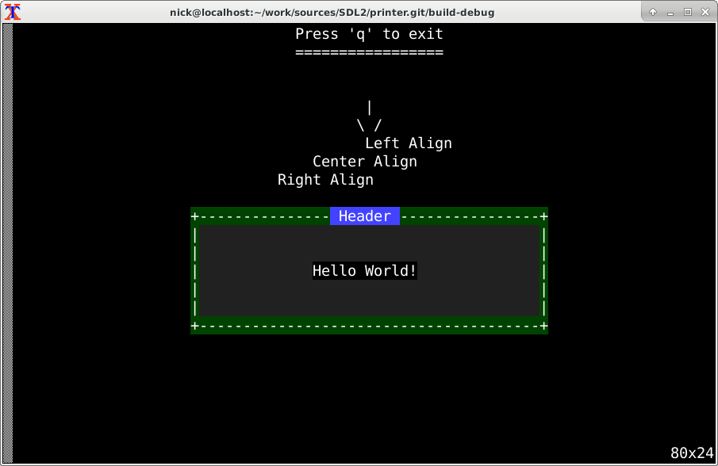
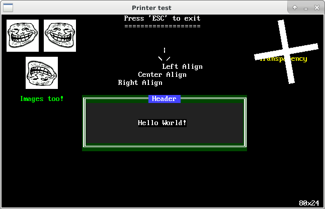

# Printer
SDL2 or ncurses character printing class library.
I made it during development of nrogue.git, somehow I managed to design good
cross-library method interface (at least I think so :-P).

Maybe this library will help somebody quickly build SDL2 or ncurses prototypes.

See example.cpp for example usage.

<TABLE>
  <TR>
    <TD align="center"><B>NCURSES</B></TD>
    <TD align="center"><B>SDL2</B></TD>
  </TR>
  <TR>
    <TD></IMG></TD>
    <TD></IMG></TD>
  </TR>  
</TABLE>
